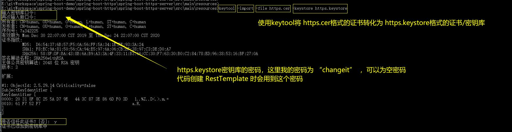

# README模板（使用一级标题）
写个demo模板，方便记忆语法和CV大法（写个概要描述）  
目标是轻量格式写作，不用记那么多语法，我也不会用那么多语法/格式，简约够用就行了  
换行时，在每行的后面加两个空格  


### 文本样式（使用三级标题）
**加粗字体**  
*斜字体*  
```java
package xx.xx;

public class mainDemo {
	public static void main(String [] args) {
		System.out.println("Hello World");
	}
}
```  


### 基本格式-有序
1. 原核生物界
2. 原生生物界
3. 真菌界
4. 植物界
5. 动物界
5.1 脊索动物门
5.1.1 哺乳纲
5.1.1.1 食肉目
5.1.1.1.1 犬科
5.1.1.1.1.1 犬属
5.1.1.1.1.1.1 狼种
5.1.1.1.2 猫科
5.1.1.1.2.1 豹属
5.1.1.1.2.1.1 虎种
5.2 节肢动物门
5.2.1 昆虫纲
5.2.1.1 膜翅目
5.2.1.1.1 蜜蜂科
5.2.1.1.1.1 蜜蜂属
5.2.1.1.1.1.1 意大利蜜蜂种
            

### 基本格式-无序
* 水果
  * 香蕉
  * 苹果
    * 红富士苹果
  * 橘子
  * 梨
* 蔬菜
  * 白菜
  * 香菜
  * 番茄
* 肉
  * 猪肉
  * 牛肉
  * 鸡肉
  
  
### 链接
[百度一下](https://www.baidu.com)  
[spring-boot和spring的AOP核心组件和流程](./spring-boot-lifecycle/README-RESOURCES/spring-boot和spring的AOP核心组件和流程.vsdx)  
  


### 表格
| 项目  | 价格   |  数量  |
| ----  | ---- | ---- |
| 计算机  | \$1600   |  5    |
| 手机    |   \$12   |  12   |
| 管线    |    \$1   |  234  |


