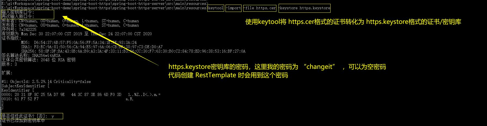

# spring-boot-http

### 本项目知识点
1. 如何启动一个spring-boot https项目

### 知识点补充
密钥对,公钥,证书,私钥,jks,keystore,truststore,cer,pfx名词说明=》https://blog.csdn.net/w451373766/article/details/7109225
证书，私钥，公钥，pfx,keystore,pem,der 都是什么？？=》https://blog.csdn.net/qq_30698633/article/details/77895151
常用的keytool命令=》https://www.cnblogs.com/aiaitie/p/9525562.html
keytool命令实操=》https://www.cnblogs.com/aigeileshei/p/8855873.html

### spring-boot-https-server作为https提供方
ssl证书的生成
`keytool -genkey -keyalg RSA -alias https -keystore keystore.jks -storepass password1 -validity 360 -keysize 2048`

spring-boot-https-server/src/main/resources/keystore.jks  是密钥库，命令行 `keytool -list -keystore keystore.jks` 可以看密钥库中的有哪些密钥
spring-boot-https-server作为https提供方，加载密钥库中指定的密钥就可以启动https服务，详见application.properties

### spring-boot-https-client作为https调用方
上面启动spring-boot-https-server后，浏览器访问 https://127.0.0.1:8443/httpsServerController/test1 可以访问
在谷歌浏览器上点击 "不安全"->"证书"->"详细信息"->"复制到文件"->"下一步"->"DER编码二进制X.509(.CER)(D)" 下载证书到spring-boot-https-client/src/main/resources/https.cer
因为spring-boot-https-server使用的密钥是https，所以这里证书名就叫https.cer(可读性)
但是.cer 是浏览器识别证书的格式，spring-boot-https-client 作为java程序，需要的证书格式是 .jks/.keystore (.jks和.keystore是一样的，虽然后缀名不一样)
接下来就是将https.cer 转换为 https.keystore（你导出成https.jks也是没问题的，java都能识别）

ok，去看spring-boot-https-server 和 spring-boot-https-client 的代码并运行试一试

